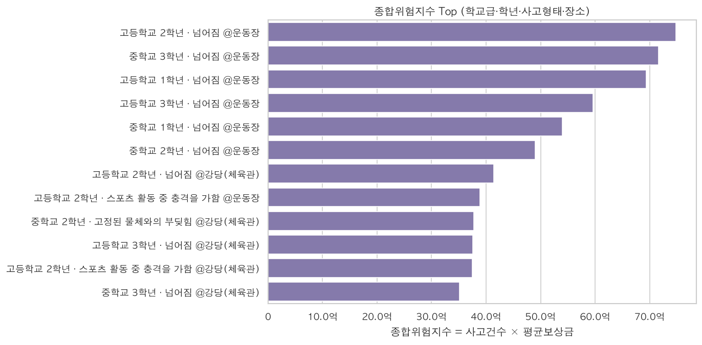
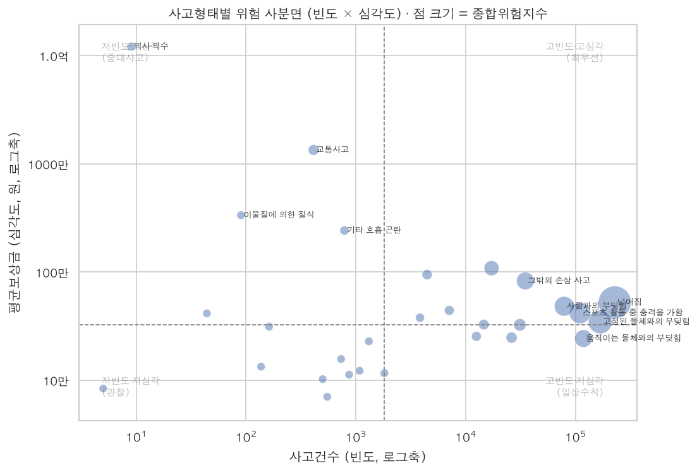
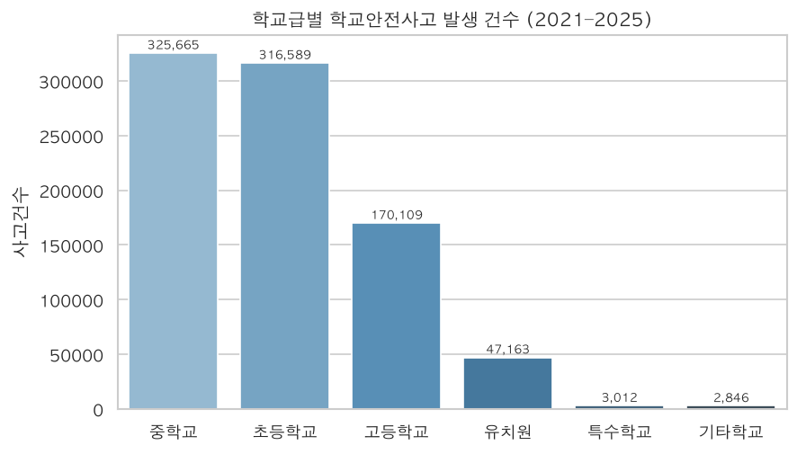
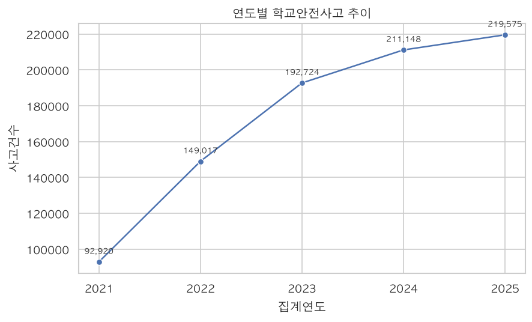

# 학년별 위험사고 예측 — 학교안전 가이드라인용 데이터 만들기

> **2026 학교안전사고 데이터 분석·활용 경진대회** 출품작 · 팀 **눈송이지킴단**
> 학교안전공제중앙회 「2021–2025 학교안전사고·보상 데이터」(약 139만 건) 기반 분석

[](https://www.python.org)
[](https://pandas.pydata.org)
-lightgrey.svg)

---

## 한 줄 요약

> **"얼마나 자주 일어나는가(빈도)"와 "얼마나 크게 다치는가(심각도)"를 곱한 _종합위험지수_ 로
> 학교급·학년별로 가장 위험한 사고유형·장소를 산출하고, 이를 학년별 안전 가이드라인에 바로
> 쓸 수 있는 데이터로 가공한다.**

기존 학교안전 통계는 대부분 **단순 발생 건수**만 보여준다. 그러나 건수가 많은 사고(넘어짐)와
피해가 큰 사고(추락·교통사고)는 다르다. 본 프로젝트는 **사고 데이터(빈도)** 와 **보상 데이터(심각도)** 를
결합해 _기대손실_ 관점의 위험 우선순위를 만든다.

```
종합위험지수 = 사고건수(빈도) × 평균보상금(1건당 피해규모, 심각도)
```

---

## 핵심 결과 (실데이터 기준)

| 지표 | 값 |
|---|---|
| 분석 사고 건수 | **865,384 건** (2021–2025) |
| 분석 보상 건수 | **528,503 건** |
| 총 보상 지급액 | **₩235,703,854,000** (약 2,357억 원) |
| 연도별 사고 추이 | 2021년 9.3만 → 2025년 22.0만 건 (**2.36배 ↑**) |
| 산출 가이드라인 | 초·중·고 **12개 학년 × Top5 = 60개** 위험 시나리오 |

**발견 1 — 빈도와 심각도는 다른 이야기를 한다.**
빈도 1위는 `넘어짐`(22.8만 건)이지만, 1건당 평균 피해가 가장 큰 것은 `익사·익수`(평균 1.2억)·`교통사고`(1,345만)·`추락` 이다.

**발견 2 — 둘을 곱하면 우선순위가 분명해진다.**
종합위험지수 1위는 `넘어짐`(지수 1,199억)으로, _흔하면서 누적 피해도 가장 큰_ 사고다.
장소로는 **운동장·강당(체육관)** 이 위험의 대부분을 차지한다.

**발견 3 — 학년마다 위험 시나리오가 다르다.**
초등 저학년은 `복도에서 사람과 부딪힘`, 중·고등은 `운동장 넘어짐·스포츠 충격`이 최상위로,
**학년 맞춤형** 안전수칙의 근거가 된다.

---

## 대표 시각화

| 종합위험지수 Top (빈도×심각도) | 위험 사분면 (빈도 vs 심각도) |
|---|---|
|  |  |

| 학교급별 발생 건수 | 연도별 추이 |
|---|---|
|  |  |

> 전체 12종 그림은 [`outputs/figures/`](outputs/figures) 참조.

---

## 분석 프레임워크

```
 사고 데이터(빈도)            보상 데이터(심각도)
  865,384건                   528,503건 · 총보상금
      │                            │
      ├── 학교급·학년·사고형태·장소 단위 집계 ──┤
      │                            │
      └──────────┬─────────────────┘
                 ▼  공통 키로 결합 (inner join)
        종합위험지수 = 사고건수 × 평균보상금
                 ▼
   ┌─────────────┴──────────────┐
   ▼                            ▼
위험 사분면 분류            학년별 Top5 가이드라인 데이터
(최우선/중대사고/일상수칙)   (t08_학년별_안전가이드라인.csv)
```

위험 사분면(빈도·심각도 중앙값 기준 4분면):

- **고빈도·고심각 (최우선 관리)** — 넘어짐, 부딪힘 등 운동장·체육관 사고
- **저빈도·고심각 (중대사고 대비)** — 익사·교통사고·추락: 드물지만 치명적
- **고빈도·저심각 (일상 안전수칙)** — 긁힘·찔림 등
- **저빈도·저심각 (관찰)**

---

## 빠른 시작

```bash
# 1) 환경
python -m venv .venv && source .venv/bin/activate
pip install -r requirements.txt

# 2) (원본 없이 재현) 합성 샘플 생성 → 분석
python scripts/make_sample_data.py
python scripts/run_analysis.py

# 3) (참가자) 원본으로 실행: data/raw/ 에 중앙회 xlsx 2개를 두면 자동 인식
python scripts/run_analysis.py
```

산출물은 `outputs/figures/*.png`(그림 12종), `outputs/tables/*.csv`(집계표 8종 + 최종 가이드라인)에 저장된다.

```python
# 추천 함수 사용 예
from src import data_loader as dl, analysis as an
acc, cmp = dl.load_accident(), dl.load_compensation()
risk = an.risk_index(acc, cmp)
an.recommend(risk, "중학교", "3학년")   # → Top5 위험 사고유형·장소
```

---

## 프로젝트 구조

```
.
├── src/                     # 분석 패키지
│   ├── config.py            #   경로·상수·도메인 정의
│   ├── data_loader.py       #   적재·전처리 (원본↔샘플 자동 전환)
│   ├── analysis.py          #   위험지수·사분면·가이드라인 핵심 로직
│   └── viz.py               #   한글 시각화 (12종)
├── scripts/
│   ├── make_sample_data.py  #   공개·재현용 합성 샘플 생성기
│   └── run_analysis.py      #   전체 파이프라인 실행
├── data/
│   ├── raw/                 #   (비공개) 원본 — .gitignore
│   └── sample/              #   (공개) 합성 샘플
├── outputs/{figures,tables} # 그림·표 산출물
├── report/                  # 기획서·보고서 (제출용)
└── notebooks/               # 탐색용 노트북
```

---

## 데이터 윤리 / 규정 준수

- 중앙회 제공 **원본 데이터는 외부 공개·재배포 금지** → 저장소에 포함하지 않음(`.gitignore`).
  공개 재현은 **합성 샘플**로 대체한다.
- 원본 데이터를 **외부 생성형 AI 서비스에 업로드하지 않았으며**, 모든 분석은 로컬에서 수행했다.
- AI 활용: 코드 구조화·문서 작성 보조에 AI(Claude)를 사용했고, 활용 범위는 보고서에 명시한다.
  **원본 데이터 레코드는 AI에 입력하지 않았다.**

## 기술 스택

`Python` · `pandas` · `numpy` · `matplotlib` · `seaborn`
